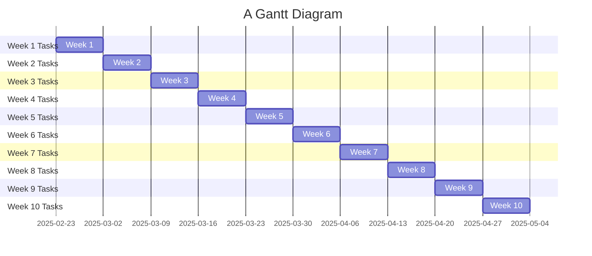

# Week 1 - Researching different data centers and study the different legends for all necessary parts on Autocad
# Week 2 - Start working on the dimensions for all the different areas of the data center while keeping in mind all the different criteria needed
# Week 3 - Work on researching background designs for assigned areas to get a rough idea of what to aim for. Try to create some barebone preliminary sketch and maybe a conceptual layout
# Week 4 - Fourth of the CAD blueprint should be completed with measurements according to the 4 acres supplied
# Week 5 - Rough outline complete with a basic breakdown of all different rooms and necessary criteria. Look into structural restraints that may cause issues
# Week 6 - Details are being added with notes on different materials that will be used as well as any necessary special materials. Look into environmental constraints that may cause problems with construction 
# Week 7 - Start estimating the budget needed for the basic materials (check over each other's work to make sure that so far everything is meshing together)
# Week 8 - Three fourth of the design is complete and the budget is made 
# Week 9 - Blueprint is completed and the budget is calculated to see if we are over budget or under budget
# Week 10 - Finishing touches on the whole project to make sure that everything is completed. Complete quality checks, compliance verification, and prep for the final presentation

